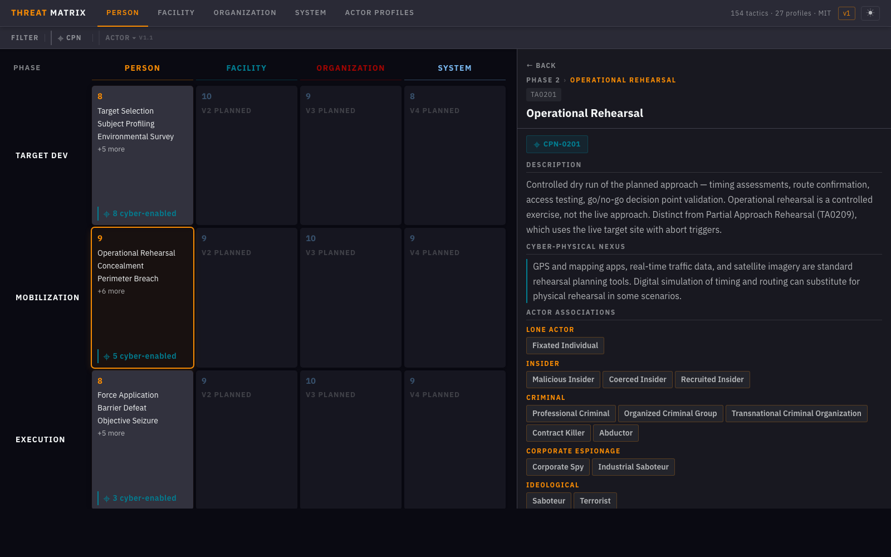

# THREAT Matrix

*Tactical Human Risk Enumeration and Adversary Taxonomy*

**Open-standard shared vocabulary for categorizing and detecting human adversary behavior in physical security and insider threats. Built from 15+ years of experience leading high-stakes threat investigations with more than 70 domestic and international partners.**  

Physical security lacks a shared, standardized vocabulary for adversary behavior. The THREAT Matrix is built to be that standard.

**[→ Launch THREAT Matrix in Browser](https://jgulyash.github.io/THREAT-Matrix/)** · **[framework.json](docs/data/framework.json)** · MIT License

---

## The Problem

The same pattern surfaced in every partner relationship: each organization had its own vocabulary for adversary behavior. Some had mature processes and detection methodology. Others had not yet identified TTPs that recurred across cases the field had been seeing for years. There was no shared language, no common reference standard, wasted time syncing incidents across teams, and no shared framework to build tooling against a stable taxonomy.

In 2023, a Lawrence Livermore National Laboratory study, sponsored by DOE/NNSA and prepared for DHS/CISA — https://doi.org/10.2172/2229613 (LLNL-TR-858139) — examined whether any existing methodology could serve as a structured framework for characterizing physical adversary action across critical infrastructure sectors. The conclusion: existing frameworks are inadequate. Most are sector- or facility-specific, focus on security assessment rather than adversary behavior, and fail to address cyber-physical risks. The THREAT Matrix is a direct response to both the documented institutional gap and the operational reality that produced it. 

## Framework Architecture

**Four target matrices. Four kill chain phases. 154 total tactics** (34 live in V1; 120 across V2–V4 planned).

### Kill Chain

The kill chain is descriptive, not prescriptive — adversaries compress, skip, and reorder phases based on opportunity and capability. The framework makes behavioral patterns visible; it doesn't assert they are inevitable or sequential.

### Target Matrices

### Actor Profiles

**27 actor profiles across 7 threat categories.** Each profile documents awareness, direction, access relationship, phase compression risk, attack vectors, behavioral markers, AI capability amplifiers, and the tactics each actor type is most likely to employ.

| Category | Profiles | Examples |
|----------|---------:|----------|
| Lone Actor | 3 | Fixated individuals, public-figure stalkers, grievance-driven attackers |
| Insider | 5 | Malicious, negligent, and compromised insiders (coerced, recruited, unwitting) |
| Criminal | 7 | Organized crime, kidnap-for-ransom, contract violence |
| Corporate Espionage | 2 | Trade secret theft, competitive intelligence operations |
| Ideological | 4 | Domestic violent extremism, terrorism, mass-casualty actors |
| Nation-State | 4 | Foreign intelligence services, state-directed disruption |
| Customer / Client Aggressor | 2 | Workplace violence escalation from customer or client relationships |

Profiles are referenced by stable ID (`AP001`–`AP029`) and connect directly to the tactics each actor type is most likely to employ. Browse them in the [interactive matrix](https://jgulyash.github.io/THREAT-Matrix/#/actors).

### Cyber-Physical Nexus (CPN)

Cyber capabilities enable and accelerate physical operations across virtually every phase for sophisticated actors. The `[CPN]` tag marks tactics where digital capabilities play a significant or primary enabling role — showing practitioners where to look for digital indicators alongside physical behaviors.

### AI Integration Architecture

The THREAT Matrix treats AI as a **force multiplier on existing attack vectors** — not a separate pathway. AI compresses Phase 1 timelines, lowers tradecraft requirements, and extends capabilities previously requiring nation-state resources to less sophisticated actors.

**Four-vector taxonomy:**

| Vector | Definition |
|--------|-----------|
| `physical_primary` | Physical action; no meaningful cyber or AI component |
| `cyber_enabled_physical` | Cyber tools support or enable a physical attack |
| `cyber_initiated_physical` | A cyber attack IS the attack; physical harm is the consequence |
| `ai_initiated_physical` | An autonomous or semi-autonomous AI system executes physical harm without real-time human direction |

The `ai_initiated_physical` vector is architecturally distinct: the attack does not route through networked cyberspace — the AI agent operates locally, autonomously, in physical space. Current documented examples include AI-directed autonomous drones and compromised autonomous vehicle systems. Every actor profile carries an `ai_enabled_risks` field documenting which AI capability amplifiers apply. Full AI architecture rationale is in the `ai_architecture` block in `docs/data/framework.json`.

---

## Build Status

*V1 deploys the Person Matrix (34 tactics). V2–V4 complete the remaining 120 tactics across the Facility, Organization, and System matrices. Each matrix release ships with its own Detection & Response slice — behavioral indicators, response protocols, and countermeasures mapped to every tactic — building practitioner-ready operational guidance alongside the taxonomy.*

---

## Using the Framework

**Browse it:** [jgulyash.github.io/THREAT-Matrix](https://jgulyash.github.io/THREAT-Matrix/) — filter by phase, CPN tag, or actor profile. Click any tactic for full detail including notes, CPN analysis, and AI risk factors.

**Build with it:** `docs/data/framework.json` is MIT licensed, versioned, and machine-readable. Use it in detection tooling, threat assessment workflows, training platforms, or agentic pipelines.

---

## Contributing

The THREAT Matrix grows through practitioner contribution. You don't need to be a developer.

- **Suggest a tactic** — open an issue describing an adversary behavior not yet in the framework
- **Flag an inconsistency** — terminology, scope, or classification issues
- **Propose a use case** — real-world scenarios help validate the framework against operational reality
- **Developer contributions** — `framework.json` schema, React SPA features, V2–V4 matrix development

See [CONTRIBUTING.md](CONTRIBUTING.md) for guidelines.

---

## License

MIT. Open reference standard. The framework's value compounds with adoption.

---

*[Jay Gulyash](https://www.linkedin.com/in/jay-gulyash-750489207) — Protective Intelligence & Insider Threat Practitioner*
