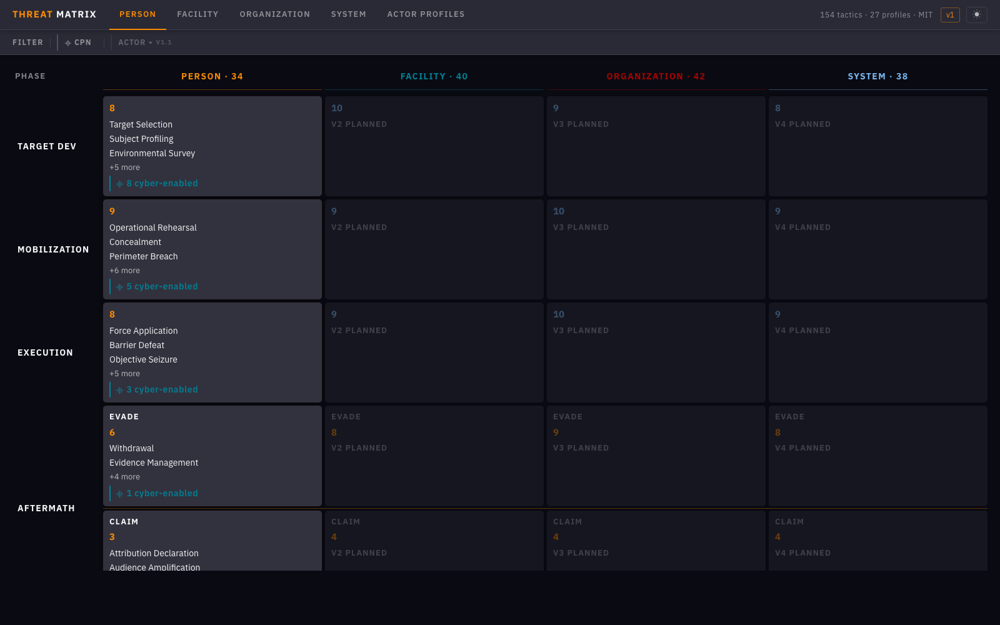
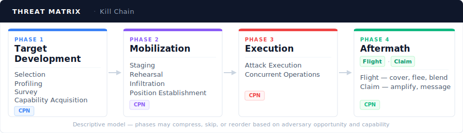
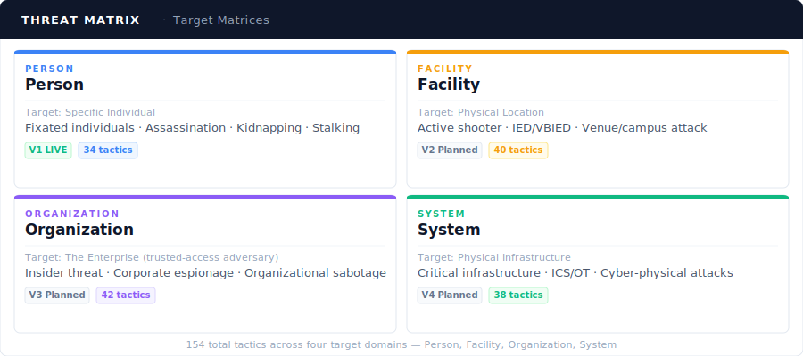
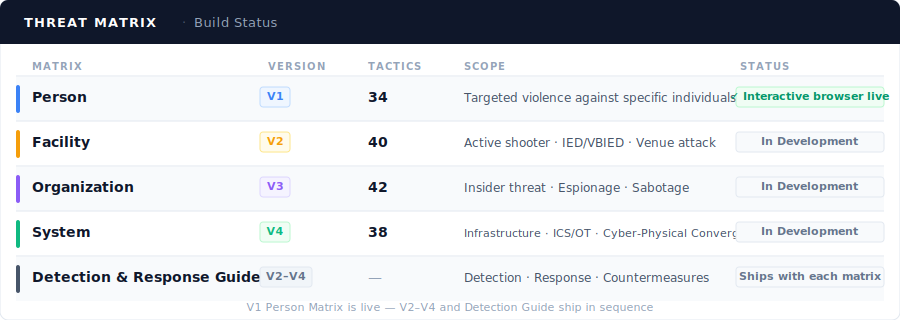

# THREAT Matrix

*Tactical Human Risk Enumeration and Adversary Taxonomy*

**Open-source physical adversarial threat taxonomy modeled after MITRE ATT&CK.**  
Physical security has no equivalent to MITRE ATT&CK. The THREAT Matrix is built to be that standard.

**[→ Interactive Matrix Browser](https://jgulyash.github.io/THREAT-Matrix/)** · **[framework.json](docs/data/framework.json)** · MIT License

---

## The Problem

Cyber security has MITRE ATT&CK — a shared, standardized vocabulary for adversary behavior that any team can use to build detection logic, compare incidents, and train analysts. Physical security has nothing like it. Every organization invents their own version of a similar framework, so they don't speak the same language, and you can't build tooling or training against a standard that doesn't exist.

In 2023, the U.S. Department of Energy commissioned a formal requirements study evaluating whether any existing methodology could serve as a "physical half of MITRE ATT&CK." Their conclusion: nothing existing was adequate. The THREAT Matrix is a direct response to that documented gap.

The THREAT Matrix is that standard for the physical domain.

## Framework Architecture

**Four target matrices. Four kill chain phases. 154 total tactics** (34 live in V1; 120 across V2–V4 planned).

> **On terminology:** The THREAT Matrix uses *tactic* in the physical security and military sense — a specific operational method an adversary employs. This differs from MITRE ATT&CK's convention, where "tactics" label high-level goal categories and "techniques" label specific behaviors. 

### Kill Chain

The kill chain is descriptive, not prescriptive — adversaries compress, skip, and reorder phases based on opportunity and capability. The framework makes behavioral patterns visible; it doesn't assert they are inevitable or sequential.

### Target Matrices

### Cyber-Physical Nexus (CPN)

Cyber capabilities enable and accelerate physical operations across virtually every phase for sophisticated actors. The `[CPN]` tag marks tactics where digital capabilities play a significant or primary enabling role — showing practitioners where to look for digital indicators alongside physical behaviors.

### AI Integration Architecture

The THREAT Matrix treats AI as a **force multiplier on existing attack vectors** — not a separate pathway. AI compresses Phase 1 timelines, lowers tradecraft requirements, and extends capabilities previously requiring nation-state resources to less sophisticated actors.

**Four-vector taxonomy:**

| Vector | Definition |
|--------|-----------|
| `physical_primary` | Physical action; no meaningful cyber or AI component |
| `cyber_enabled_physical` | Cyber tools support or enable a physical attack |
| `cyber_initiated_physical` | A cyber attack IS the attack; physical harm is the consequence |
| `ai_initiated_physical` | An autonomous or semi-autonomous AI system executes physical harm without real-time human direction |

The `ai_initiated_physical` vector is architecturally distinct: the attack does not route through networked cyberspace — the AI agent operates locally, autonomously, in physical space. Current documented examples include AI-directed autonomous drones and compromised autonomous vehicle systems. Every actor profile carries an `ai_enabled_risks` field documenting which AI capability amplifiers apply. Full AI architecture rationale is in the `ai_architecture` block in `docs/data/framework.json`.

---

## Build Status

*V1 deploys the Person Matrix (34 tactics). V2–V4 complete the remaining 120 tactics. The Detection & Response Guide maps every tactic to detection indicators, response protocols, and countermeasures — building practitioner-ready operational guidance alongside each matrix release.*

---

## Using the Framework

**Browse it:** [jgulyash.github.io/THREAT-Matrix](https://jgulyash.github.io/THREAT-Matrix/) — filter by phase, CPN tag, or actor profile. Click any tactic for full detail including notes, CPN analysis, and AI risk factors.

**Build with it:** `docs/data/framework.json` is MIT licensed, versioned, and machine-readable. Use it in detection tooling, threat assessment workflows, training platforms, or agentic pipelines.

---

## Contributing

The THREAT Matrix grows through practitioner contribution. You don't need to be a developer.

- **Suggest a tactic** — open an issue describing an adversary behavior not yet in the framework
- **Flag an inconsistency** — terminology, scope, or classification issues
- **Propose a use case** — real-world scenarios help validate the framework against operational reality
- **Developer contributions** — `framework.json` schema, React SPA features, V2–V4 matrix development

See [CONTRIBUTING.md](CONTRIBUTING.md) for guidelines.

---

## License

MIT. Open reference standard. The framework's value compounds with adoption.

---

*[Jay Gulyash](https://www.linkedin.com/in/jay-gulyash-750489207) — Protective Intelligence & Insider Threat Practitioner*
