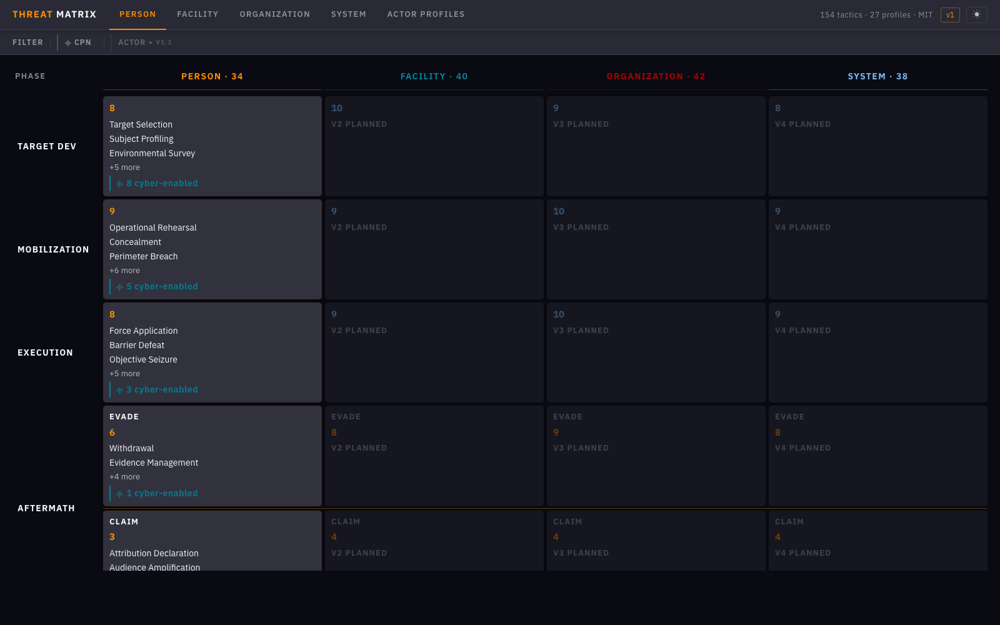
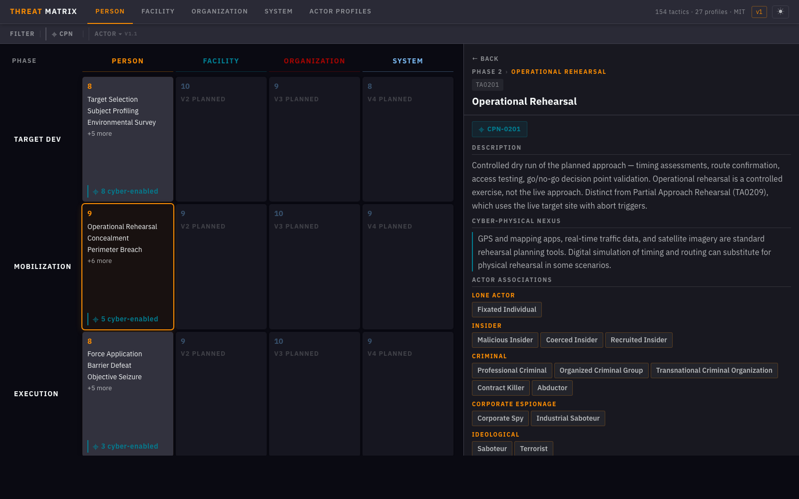
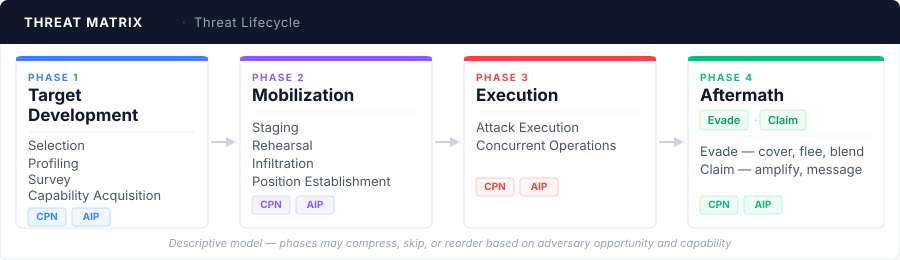
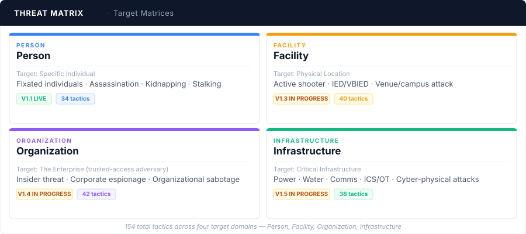
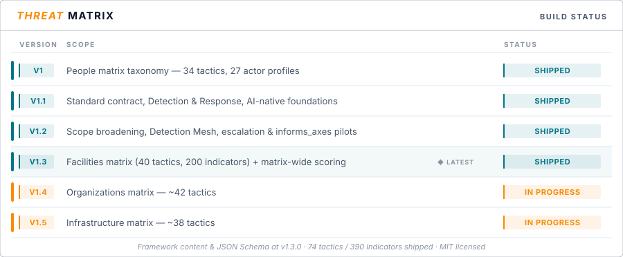

# THREAT Matrix
 
*Tactical Human Risk Enumeration and Adversary Taxonomy Matrix*
 
The physical threat domain lacks a shared, open, standardized vocabulary. The **THREAT Matrix** is built to be that standard, one that not only catalogs threat behavior but scores it to support operational decisions.

Four target matrices — **People, Facilities, Organizations, Infrastructure** — span a four-phase Threat Lifecycle: **Target Development → Mobilization → Execution → Aftermath**. It documents 154 tactics and 27 actor profiles across seven threat categories, with a behavioral Detection Mesh, escalation scoring, and response protocols layered on top. The THREAT Matrix names the behavior, weighs the threat, and drives the response.

Cyber-Physical Nexus and AI-Initiated-Physical tags surface online-to-physical mobilization pathways and AI-enabled reconnaissance across tactics.

From V1, the THREAT Matrix is structured as a headless, machine-consumable threat signal library, built for RAG systems, AI agents, MCP clients, and downstream detection and investigation platforms. It cross-walks to established cyber and AI-systems adversary frameworks for interoperability with existing programs. MIT-licensed, it ships with a UI and a reference Python consumer that demonstrate the contract end-to-end.

Built for the analysts, investigators, field teams, and engineers across corporate security, law enforcement, and the Intelligence Community — and for the leaders who rely on their work, and the educators and researchers shaping the discipline. Drawn from 15+ years of experience leading high-stakes threat investigations with more than 70 domestic and international partners.
 
**[→ Launch THREAT Matrix in Browser](https://jgulyash.github.io/THREAT-Matrix/)** · **[Responsible Use](#responsible-use)** · **[framework.json](docs/data/framework.json)** · **[JSON Schema](docs/data/framework.schema.json)** · **[Reference consumer](examples/python_consumer.py)** · MIT License
 

 

 
---
 
## The Problem
 
The same pattern surfaced across most partner relationships: each organization had its own vocabulary for physical threat behavior. Some had mature processes and detection methodology. Others had not yet identified adversary tactics, techniques, or behavior that recurred across cases the field had been seeing for years. There was no shared language, no common reference standard, wasted time syncing incidents across teams, and no shared framework to build tooling against a stable taxonomy.
 
In 2023, a Lawrence Livermore National Laboratory study, sponsored by DOE/NNSA and prepared for DHS/CISA examined whether any existing methodology could serve as a structured framework for characterizing physical adversary action across critical infrastructure sectors. The conclusion: existing frameworks are inadequate. Most are sector- or facility-specific, focus on security assessment rather than adversary behavior, and fail to address cyber-physical risks. The THREAT Matrix addresses both the documented institutional gap and the operational reality that produced it.
> McGrath, J.K., Scott, H.R., & Slone, L.R. (2023). *Requirements and Recommendations
> for a Physical Attack Characterization Framework* (LLNL-TR-858139). Lawrence Livermore
> National Laboratory. https://doi.org/10.2172/2229613
 
## Framework Architecture
 
**Four target matrices — People, Facilities, Organizations, Infrastructure. A four-phase Threat Lifecycle: Target Development → Mobilization → Execution → Aftermath. 154 total tactics** (34 live in V1; 120 across V1.3–V1.5 planned).
 
### Threat Lifecycle
 

 
The Threat Lifecycle is descriptive, not prescriptive — adversaries compress, skip, and reorder phases based on opportunity and capability. The framework makes behavioral patterns visible; it doesn't assert they are inevitable or sequential. Detection and response operate as a Detection Mesh across the lifecycle (see below), not as a linear chain. The result is a unified threat picture security professionals can use for investigation, prioritization, and physical-threat mitigation. Escalation scoring backs that prioritization with a per-indicator severity signal.
 
### Target Matrices
 

 
Each tactic in the catalog lives in exactly one matrix, determined by the adversary's primary objective. The People matrix covers harm, control, coercion, or surveillance directed at one or more human beings — V1.2.2 broadened this scope from V1's named-individual focus to include mass-casualty events and group-targeted attacks (see `target_identity` sub-dimension). The Facilities, Organizations, and Infrastructure matrices cover physical venues, institutions, and critical systems respectively. Real-world incidents may legitimately invoke tactics from multiple matrices simultaneously; cross-matrix coverage is expressed through the Detection Mesh (`correlates_with`) rather than by re-classifying tactics. Full scope sentences and the framework-vs-operational boundary rule live in the `matrices.{name}.scope` and `matrices.boundary_rule` fields of `framework.json`.
 
### Actor Profiles
 
**27 actor profiles across 7 threat categories.** Each profile documents awareness, direction, access relationship, phase compression risk, attack vectors, behavioral markers, AI capability amplifiers, and the tactics each actor type is most likely to employ.
 
| Category | Profiles | Examples |
|----------|---------:|----------|
| Lone Actor | 3 | Fixated individuals, public-figure stalkers, grievance-driven attackers |
| Insider | 5 | Malicious, negligent, and compromised insiders (coerced, recruited, unwitting) |
| Criminal | 7 | Organized crime, kidnap-for-ransom, contract violence |
| Corporate Espionage | 2 | Trade secret theft, competitive intelligence operations |
| Ideological | 4 | Domestic violent extremism, terrorism, mass-casualty actors |
| Nation-State | 4 | Foreign intelligence services, state-directed disruption |
| Customer / Client Aggressor | 2 | Workplace violence escalation from customer or client relationships |
 
Profiles are referenced by stable ID (`AP001`–`AP029`) and connect directly to the tactics each actor type is most likely to employ. Browse them in the [interactive matrix](https://jgulyash.github.io/THREAT-Matrix/#/actors).
 
### Cyber-Physical Nexus (CPN)
 
Cyber capabilities enable and accelerate physical operations across virtually every phase for sophisticated actors. The `[CPN]` tag marks tactics where digital capabilities play a significant or primary enabling role, surfacing online-to-physical mobilization pathways — and showing practitioners where to look for digital indicators alongside physical behaviors.
 
### Detection Mesh
 
THREAT Matrix treats detection and response as a mesh, not a chain. Indicators from any phase, any matrix, and any detection domain can correlate with indicators from anywhere else in the framework. Countermeasures from any domain can compensate for gaps in another. Response protocols from any stakeholder — threat management teams, HR, legal, law enforcement, protective operations, EAP — fire in parallel on the same indicator set, each acting within their own authority.
 
The mesh is machine-walkable. Three graph link fields make it traversable by AI agents, correlation engines, and coverage-gap analysis tools:
 
| Field | Lives on | Purpose |
|---|---|---|
| `correlates_with` | Indicators | Cross-phase, cross-matrix indicator correlation |
| `compensates_for` | Countermeasures | Coverage-gap analysis across countermeasure domains |
| `coordinates_with` | Response Protocols | Parallel-execution links across stakeholder authorities |
 
Full architectural rationale is in the `detection_mesh` block in `docs/data/framework.json`.

### Escalation Scoring

The taxonomy names a behavior. The escalation layer scores it — turning "this indicator was observed" into "here is how severe it is, and how urgently it warrants action." Each scored indicator carries a `temporal_signature` and four `escalation_axes`; the framework computes a weight and severity band from them, so downstream consumers receive a ready-to-use priority signal rather than raw values to interpret.

Escalation scoring now covers **all 190 People-matrix indicator classes across all four phases** — every indicator carries a `temporal_signature`, four `escalation_axes`, a computed `escalation_weight`, and a `severity_band`. Blast is authored to method-revealed collateral ceilings (see the `escalation_rubric` in `framework.json`). Nineteen People-matrix indicators band critical under the recalibrated thresholds (escalation_rubric v1.2.0): the direct-force behaviors held there by the casualty severity floor, plus the weight-driven criticals — mass-casualty force application, method-revealing capability acquisitions, and the highest-weight in-execution commitment and barrier-defeat behaviors. The `informs_axes` annotation layer (a separate, coarser signal about what an indicator reveals) now covers all 190 indicators matrix-wide, authored through the sealed-blind inter-rater reliability process (seven chunks, each gated at weighted κ ≥ 0.60).

**temporal_signature** — where the indicator sits on the threat clock: `horizon → advancing → imminent → staging → in_progress → aftermath`. Four of the six split into early/late stages; `staging` and `in_progress` stay single-stage because their timelines are inherently compressed.

**escalation_axes** — four authored values, each 0.0–10.0:

| Axis | Measures |
|---|---|
| `impact_potential` | Magnitude of harm the behavior directly produces or imminently enables — a grievance or profiling step carries little realized harm; capability acquisition and force application carry most or all of it. This is a severity gradient along the pathway, distinct from `temporal_signature` (which measures *how soon*, not *how bad*). |
| `blast_radius_potential` | Geographic / population scope — intended targets plus expected collateral casualties, single victim to mass-casualty (see `blast_radius_guidance`) |
| `recoverability_inverse` | How hard the harm is to undo (higher = harder) |
| `detectability` | How observable the indicator is, in flight, to trained personnel |

**escalation_weight** — computed, not authored: the geometric mean of `impact_potential`, `blast_radius_potential`, `recoverability_inverse`, and inverted detectability (`10 − detectability`). The geometric mean is deliberate — a low value on any single axis pulls the whole weight down, so a high score requires all four dimensions to be elevated and no axis can be fully compensated by the others.

**severity_band** — computed from the weight against fixed thresholds, giving each indicator a stable categorical severity for filtering, triage, and display. One triage exception: behaviors that apply **direct physical force to a person** carry a `severity_floor` of `critical`, so their band is the greater of the computed band and that floor. A casualty is critical at any scale — the severity math gates the top band on `blast_radius` (population scope), which would leave a single-victim killing at high, but for triage any application of force to a person is a top-priority event. The `escalation_weight` itself is never floored, so the severity *gradient* between a single assault and a mass bombing is preserved even though both band as critical (see `severity_floor_rule` in `escalation_rubric`).

**assessment_guidance** — tactic-level prose that sits alongside the computed score: credibility / capability / intent / opportunity anchors, false-positive context, threshold guidance, and an escalation priority. Where the weight is the quantitative signal, `assessment_guidance` is the structured human-judgment layer — what raises or lowers confidence in a finding, and what looks like the tactic but isn't.

Full scoring rationale, the axis rubric, and band thresholds live in the `escalation_rubric` block in `docs/data/framework.json`.

### Cross-Framework Interoperability
 
THREAT Matrix's four-phase Threat Lifecycle is cross-walked to established adversary threat frameworks via the `phase_mappings` block in `docs/data/framework.json`
 
A query against THREAT Matrix Phase 2 (Mobilization) can retrieve documents tagged to the other frameworks mapped phase because the mapping is machine-readable. THREAT Matrix is the physical-adversary lane. Other frameworks address the cyber-adversary and AI-systems-adversarial lanes, while others cover aspects of an insider threat adversary. The frameworks meet at the cross-walk; they do not compete.
 
### AI Integration Architecture
 
The THREAT Matrix treats AI as a **force multiplier on existing attack vectors** — not a separate pathway. AI compresses Phase 1 timelines, lowers tradecraft requirements, and extends capabilities previously requiring nation-state resources to less sophisticated actors.
 
**Four-vector taxonomy:**
 
| Vector | Definition |
|--------|-----------|
| `physical_primary` | Physical action; no meaningful cyber or AI component |
| `cyber_enabled_physical` | Cyber tools support or enable a physical attack |
| `cyber_initiated_physical` | A cyber attack IS the attack; physical harm is the consequence |
| `ai_initiated_physical` | An autonomous or semi-autonomous AI system executes physical harm without real-time human direction |
 
The `ai_initiated_physical` vector is architecturally distinct: the attack does not route through networked cyberspace — the AI agent operates locally, autonomously, in physical space. Current documented examples include AI-directed autonomous drones and compromised autonomous vehicle systems. Every actor profile carries an `ai_enabled_risks` field documenting which AI capability amplifiers apply. Full AI architecture rationale is in the `ai_architecture` block in `docs/data/framework.json`.
 
---
 
## Responsible Use

**Audience.** THREAT Matrix is built for the analysts, investigators, field teams, and engineers across corporate security, law enforcement, and the Intelligence Community — and for the leaders who rely on their work, and the educators and researchers shaping the discipline. The framework supports the work of recognizing patterns of physical-threat behavior, characterizing activity in motion, and mitigating outcomes across the threat lifecycle. It covers four target matrices — People, Facilities, Organizations, and Infrastructure — with Cyber-Physical Nexus tagging where digital and physical threat intelligence converge.

**What this provides.** THREAT Matrix maps what adversaries do, when, and why, so analysts and investigators can recognize patterns in their casework and respond with context. It supports the workflow of analysts, investigators, and security teams across the threat lifecycle — from recognizing pre-attack indicators, to characterizing activity already in motion, to mapping completed cases against a shared structure. The taxonomy is published as machine-readable JSON (`framework.json`); security professionals work with it through the published viewer, custom integrations their team builds, or AI agents that read the framework directly.

**Scope.** What's in scope: adversary behavior at the tactic and indicator level — what adversaries do, when in the threat lifecycle, in what patterns, with what observable signals, and against what countermeasures and response protocols. What's out of scope: operational-execution detail — exploit code, weapon construction, step-by-step attack tradecraft, and targeting information for specific persons or organizations.

**Acceptable use.** Case mapping. Investigation and threat-assessment workflow support. Detection-rule and alert development. Threat-hunting workflow design. Security-program planning. Analyst and investigator training. Intelligence analysis. Academic research. Tooling and AI agents that consume the `framework.json` contract for legitimate threat-assessment, protective intelligence, investigative, and security-operations work.

**Unacceptable use.** Operational planning of attacks. Targeting of specific persons, facilities, or organizations. Adversarial use against the analysts and professionals the framework is built to serve. Inclusion in tooling, content, or services that facilitate harm.

**Reporting concerns.** If you believe content in this repository falls outside the scope or acceptable-use framework above, open an issue with the `responsible-use` label.

---

## Standard Contract
 
V1.1 establishes THREAT Matrix as a headless-first open standard. The contract has four properties:
 
| Property | Where it lives |
|---|---|
| **Canonical artifact** | [`docs/data/framework.json`](docs/data/framework.json) — single source of truth. The SPA is one consumer of this file, not its primary expression. |
| **Formal schema** | [`docs/data/framework.schema.json`](docs/data/framework.schema.json) — JSON Schema (draft 2020-12) that every consumer validates against. Current schema version: 1.2.2 (adds `matrices.boundary_rule`, per-matrix `scope` sentences, `target_identity` sub-dimension on indicators, `target_identity_scope` on tactics, `primary_objective_evidence_tier` on indicators). |
| **Versioning + stability policy** | Semver applied independently to the framework artifact (`version`) and the schema (`schema_version`) — see [VERSIONING.md](docs/VERSIONING.md). Stable identifier contract (`TA####`, `AP###`, `IND-*`, `CM-*`, `RP-*`) defined in [IDENTIFIERS.md](docs/IDENTIFIERS.md) — IDs are never reused, even after deprecation. Lifecycle states and sunset rules in [DEPRECATION.md](docs/DEPRECATION.md). |
| **Multiple independent consumers** | The React SPA at jgulyash.github.io/THREAT-Matrix; the reference Python consumer at [`examples/python_consumer.py`](examples/python_consumer.py) (with [`examples/README.md`](examples/README.md) as a starting-point guide); community consumers welcome. |
 
Standards talk to platforms. The contract is what makes integrations with RAG systems, AI agents, MCP-based tooling, and downstream security platforms tractable rather than bespoke.
 
---
 
## Build Status
 

 
| Version | Scope | Status |
|---|---|---|
| **V1** | People matrix taxonomy (34 tactics) | Shipped |
| **V1.1** | Standard contract (JSON Schema, versioning policy, stable IDs, reference consumer) + People Detection & Response + AI-native foundations (`phase_mappings`, `detection_mesh`, `evidence_basis`) | Shipped |
| **V1.2** | People-matrix scope broadening (one or more human beings; `target_identity`) + Detection Mesh with indicator detail page + escalation scoring & `informs_axes` (experimental pilots, chunk-1) + assessment guidance | Shipped |
| **V1.3** | Facilities matrix complete (~40 tactics) | In Progress |
| **V1.4** | Organizations matrix complete (~42 tactics) | In Progress |
| **V1.5** | Infrastructure matrix complete (~38 tactics) | In Progress |
| **V2** | Platform release: custom domain, Python and TypeScript SDKs, MCP server, RAG embeddings, change feed | Planned |
| **V3** | Real-world case library | Planned |
| **V4** | AI integration and vector embeddings | Planned |
| **V5** | Continuous learning loop | Future |
 
*Each matrix release (V1.3–V1.5) ships its own Detection & Response slice — behavioral indicators, response protocols, and countermeasures mapped to every tactic — building practitioner-ready operational guidance alongside the taxonomy. Full roadmap: [`ROADMAP.md`](ROADMAP.md).*
 
---
 
## Using the Framework
 
**Browse it:** [jgulyash.github.io/THREAT-Matrix](https://jgulyash.github.io/THREAT-Matrix/) — filter by phase, CPN tag, or actor profile. Click any tactic for full detail including notes, CPN analysis, AI risk factors, and Detection Mesh links.
 
**Build with it:** `docs/data/framework.json` is MIT licensed, semver versioned, schema-validated, and machine-readable. Validate against [`framework.schema.json`](docs/data/framework.schema.json), then use the framework in detection tooling, threat-assessment workflows, training platforms, RAG pipelines, or agentic systems.
 
### Consumers
 
The SPA is one consumer of the standard. Other consumers shipped or planned:
 
- **[Reference Python consumer](examples/python_consumer.py)** — minimal worked example: fetch, validate, filter by phase, look up actor profiles by ID. Build your own from it.
- **MCP server** — AI agents query the framework natively over Model Context Protocol (planned, V2).
- **Python and TypeScript SDKs** — thin wrappers over schema-validated fetch (planned, V2).
- **Pre-built RAG embeddings** — tactics, indicators, countermeasures, field_notes embedded for semantic retrieval (planned, V2).
- **Community consumers** — visualizations, integrations, ingestion pipelines welcome. Submit a link via issue and yours gets listed here.
- **Schema-validated consumers** - read each indicator's computed `escalation_weight` and `severity_band` directly — a RAG pipeline or AI agent gets a ready-to-use priority signal without implementing the rubric itself.
 
---
 
## Contributing
 
The THREAT Matrix grows through practitioner contribution. You don't need to be a developer.
 
- **Suggest a tactic** — open an issue describing an adversary behavior not yet in the framework
- **Flag an inconsistency** — terminology, scope, or classification issues
- **Propose a use case** — real-world scenarios help validate the framework against operational reality
- **Developer contributions** — schema work, React SPA features, V1.3–V1.5 matrix tooling, alternative consumers (CLIs, language SDKs, MCP integrations, visualizations)
 
See [CONTRIBUTING.md](CONTRIBUTING.md) for guidelines.
 
---
 
## License
 
MIT. Open standard for the physical-threat domain. Value compounds with adoption.
 
---
 
## Acknowledgments and Notices
 
THREAT Matrix is grounded in decades of field investigations, public news articles and case files, and published threat-assessment research from NTAC, FBI, CISA, ODNI/NITTF, LLNL, SEI/CERT, ASIS International, and peer-reviewed scholarship by Fein, Vossekuil, Meloy, Gill, White, Calhoun, and Weston. Full citations live in [`docs/data/framework.json`](docs/data/framework.json) under `bibliography`. Source license notices, prior-art positioning, and trademark statements: [`NOTICES.md`](NOTICES.md).
